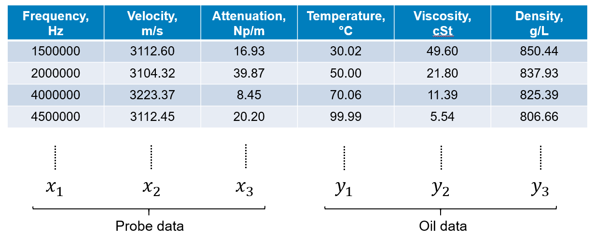
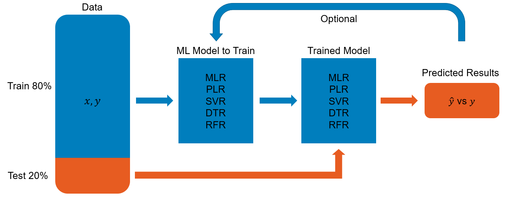
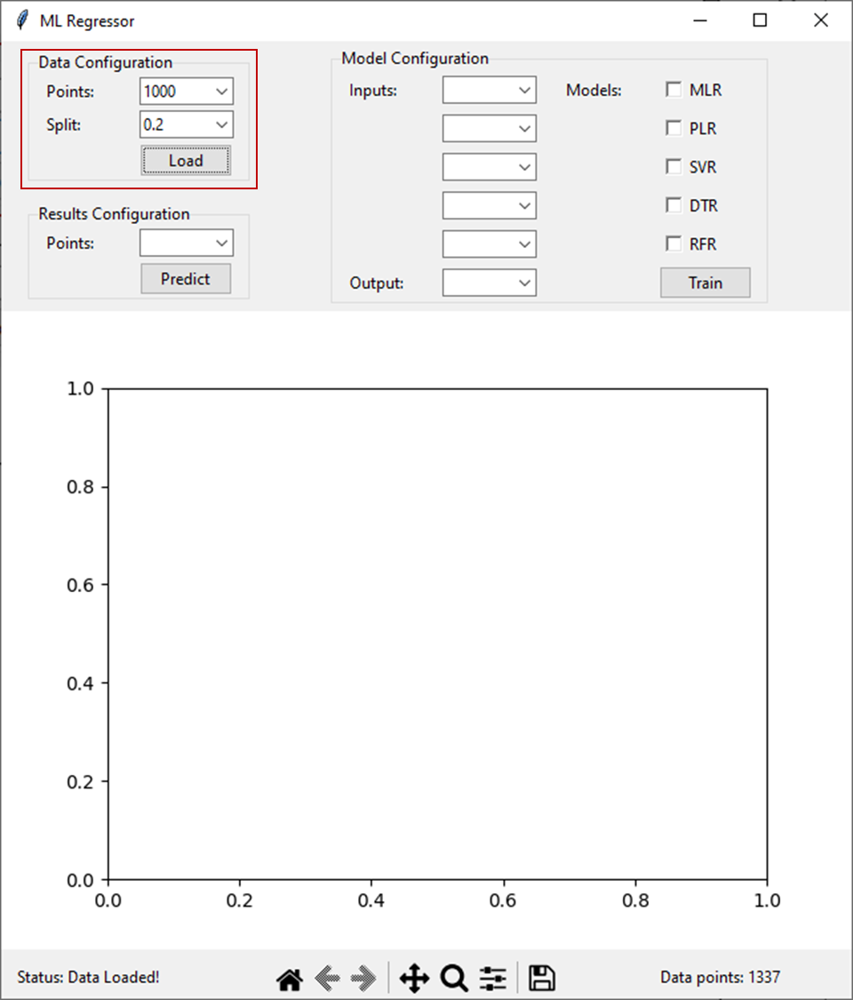
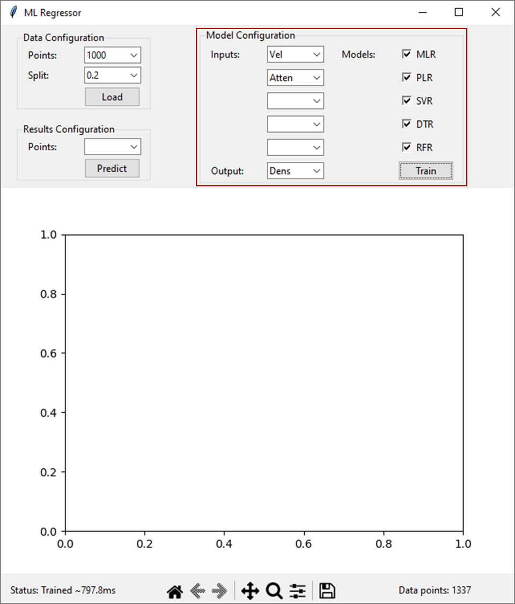
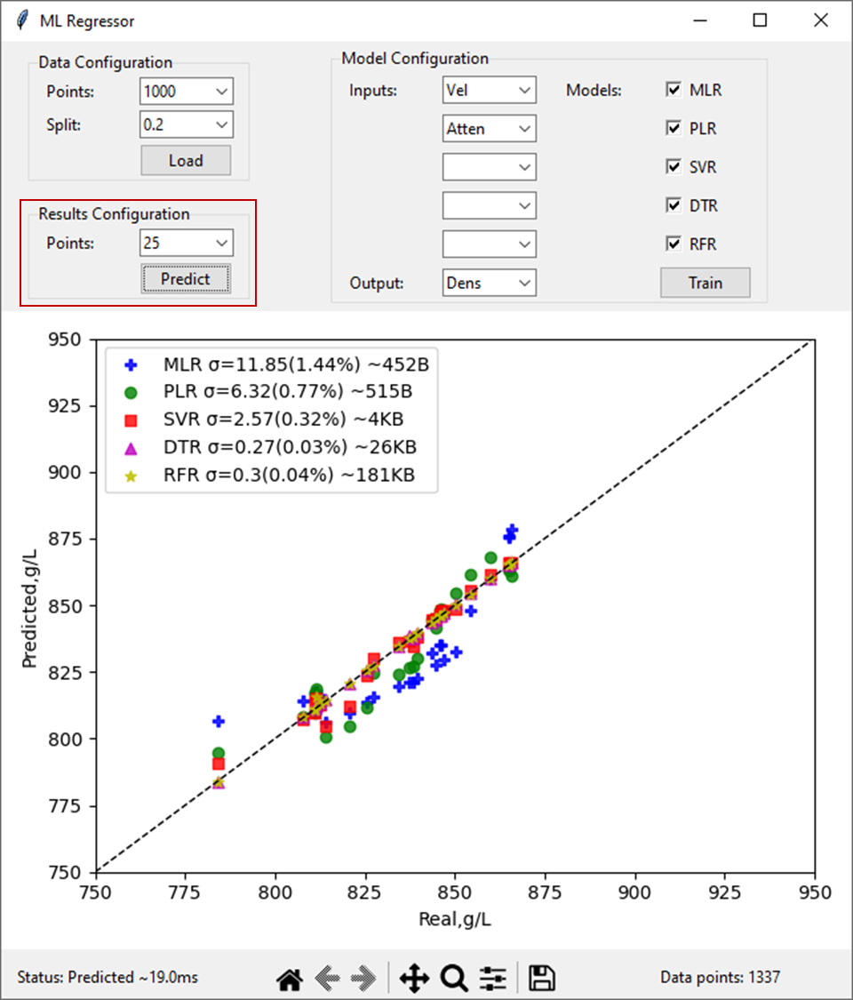
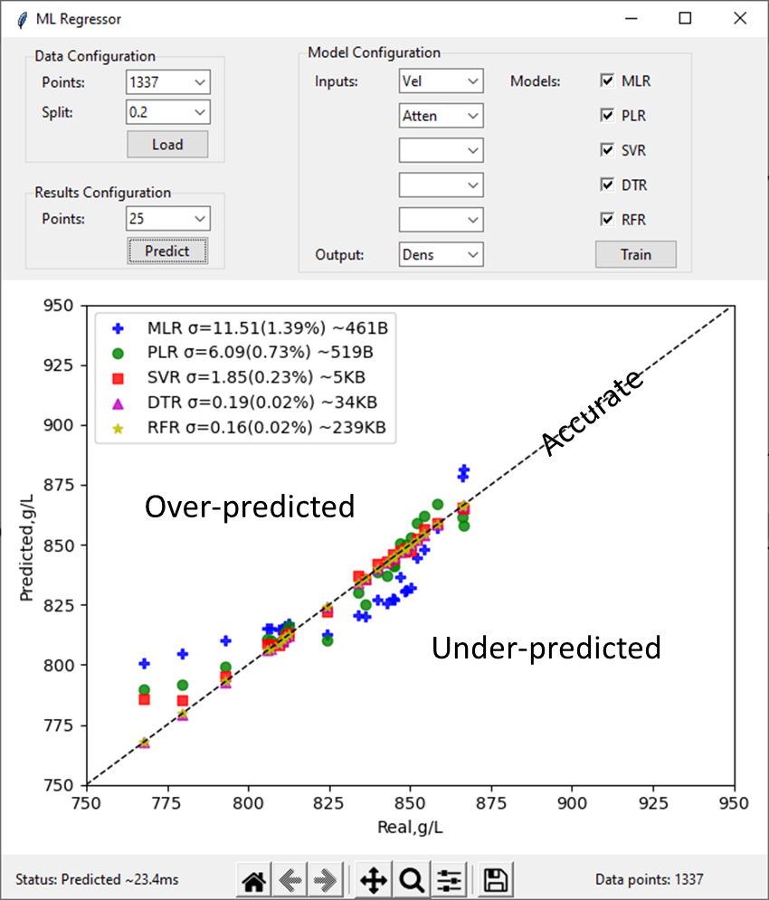
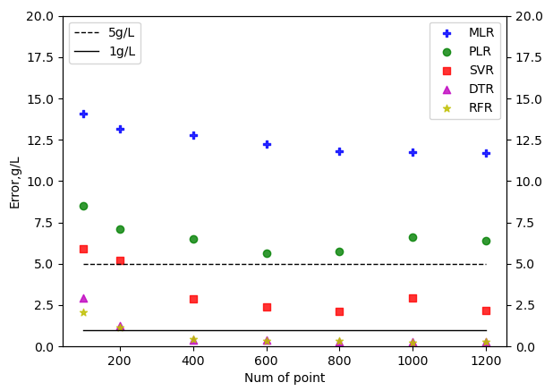
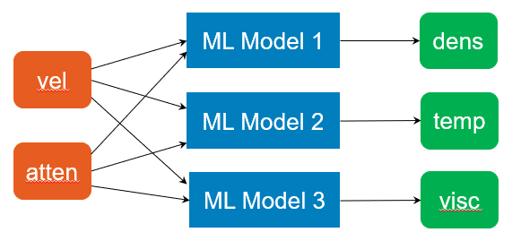
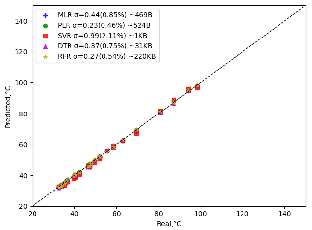
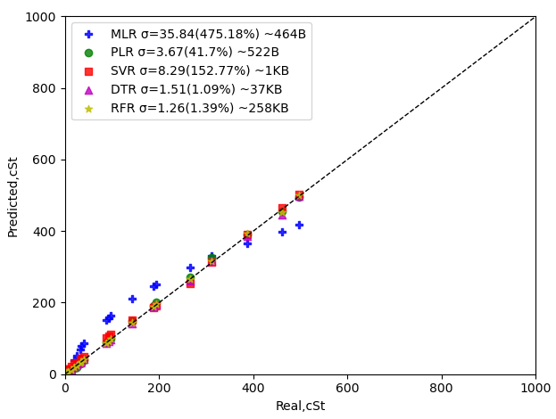

<u>Purpose</u>

To determine the best regression model for the following data using
Machine Learning (ML). Probe data are collected using sensors and oil
data are what we want to predict from the probe data.

<u>Method</u>

The probe data can be used as inputs to the models and oil data the
outputs. For example, use velocity and attenuation to predict viscosity
or density.

These are the regression models implemented to train/test:

- Multiple Linear Regression (MLR)

- Polynomial Linear Regression (PLR)

- Support Vector Regression (SVR)

- Decision Tree Regression (DTR)

- Random Forest Regression (RFR)

Use the following procedure to train and test the models:

1.  Split the dataset into a training set and a testing set. One for
    training the ML model and one for testing it.

2.  Training the model with the training set and deploy the model.

3.  With the trained model, predict the oil data from the probe data and
    compare with the real data collected.

Finally, we set the criteria for a good model - for example, the
prediction accuracy should be \<1°C for temperature.

<u>Machine Learning Regression</u>

The app uses the scikit-learn library to build the ML models. Install
the required python packages and execute the programme. Use the
following steps:

1.  In the ‘Data Configuration’ panel, click on ‘Load’ to open file
    dialog. Choose data file to open. Enter values for ‘Points’ and
    ‘Split’ for data points and split to use for training and testing
    the models. Points must not exceed the maximum of data points
    available, and split must between 0.0 and 1.0.

2.  In the ‘Model Configuration’ panel, choose ‘Inputs’ to the models
    from the dropdown lists. For example, ‘Atten’ and ‘Vel’ for
    attenuation and velocity. Choose ‘Output’ from the models from the
    dropdown lists. For example, ‘Dens’ for density. From the ‘Models’
    list, tick the ones to train and test. Click on ‘Train’. The trained
    models will be deployed in the same folder as the data file.

3.  In the ‘Results Configuration’ panel, enter value for ‘Points’ to
    predict using the models. The results will be displayed in the
    window.

<u>Results</u>

The predicted values using the models are plotted against the real
values. The mean error and mean percentage error are calculated for each
model using the following formula:

sigma = mean(abs(Predicted - Real))

sigma% = mean(abs(Predicted - Real)/Real*100)%

The ‘Accurate’ curve that divides the plots into halves is where
‘Predicted’ equals ‘Real’ values. Results over the curve are
over-predicted and those that are under the curve are under-predicted.

Accuracy usually improves when models are trained with more data points
but too many points can also cause overfitting. The following plots show
the prediction error for density against number of data points used to
train the model. Accuracy improves exponentially initially and reaches
‘equilibrium’ after 400, where the improvement with more training data
is insignificant or worse. Taking 5g/L or 1g/L as target accuracy,
models with accuracy better than 5g/L are SVR, DTR and RFR, models with
accuracy better than 1g/L are DTR and RFR.

<u>Multiple parameter prediction</u>

The same inputs can be used to train models to predict different
outputs. For example, temperature and viscosity as well as density.

The following plots show the prediction for temperature by the trained
models using attenuation and velocity as inputs. All the models seem to
perform well, with error <1°C.

The following plots show the prediction for viscosity by the trained
models using attenuation and velocity as inputs. PLR, DTR and RFR seem
to perform better than the other models, with error <4%.

